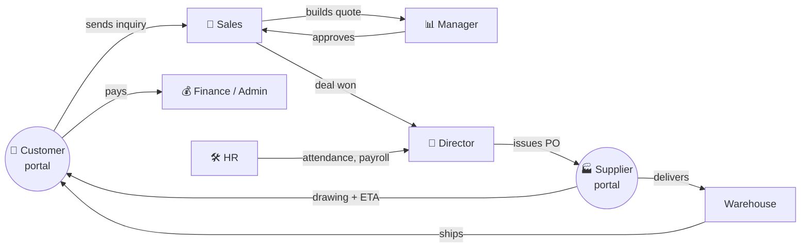
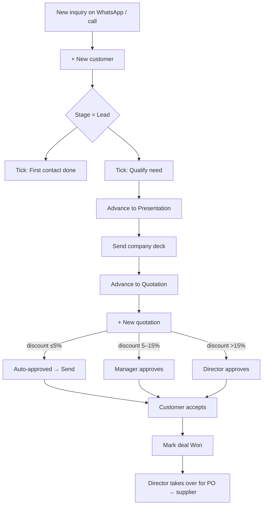
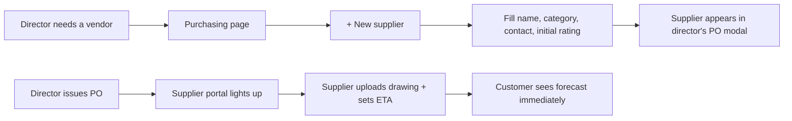
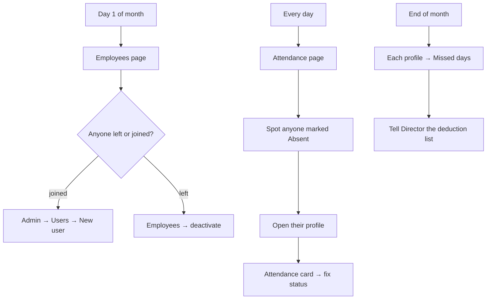
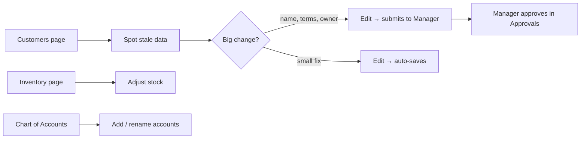
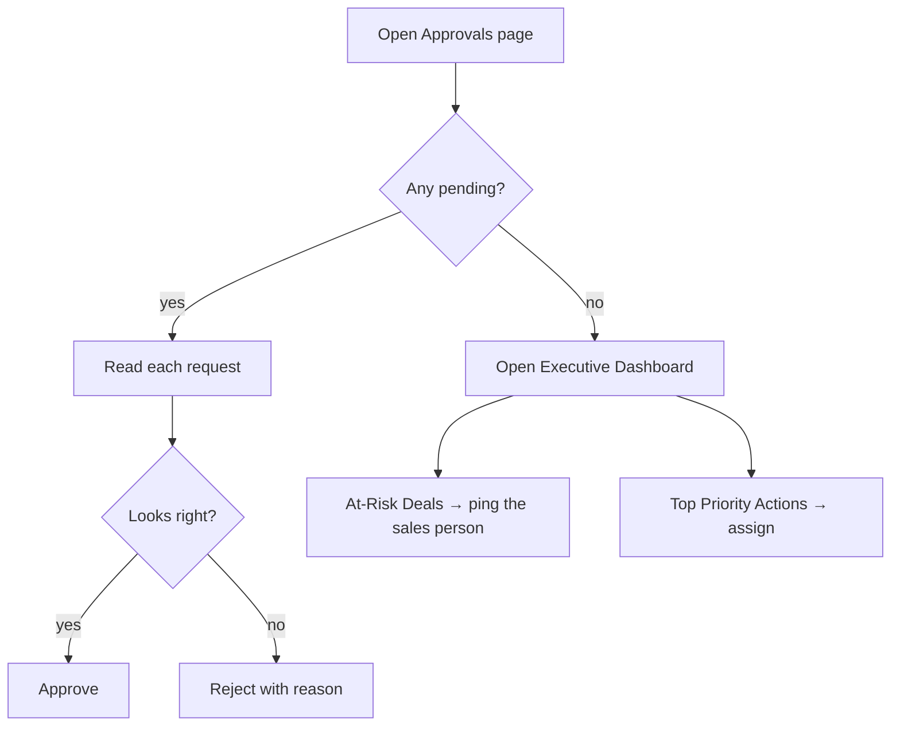
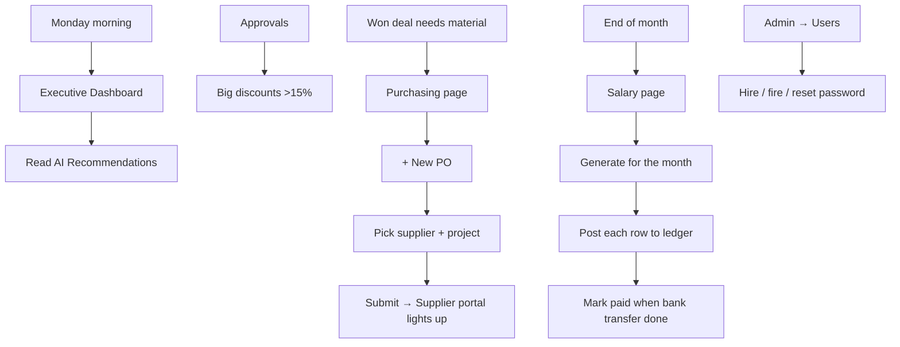
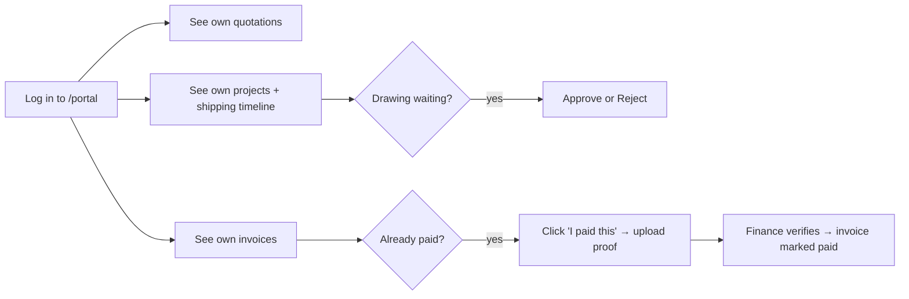
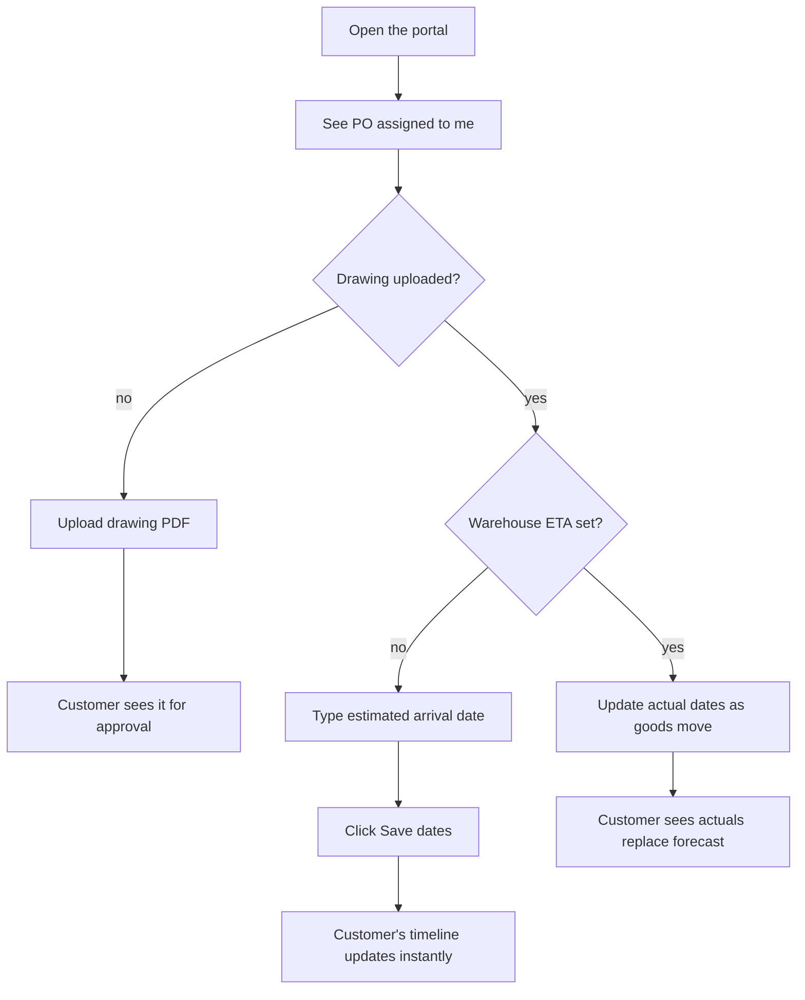

# Role Playbooks — Transmisi Eng

> One short guide per role. Read your own, ignore the rest. Each one tells
> you (1) what your job in the system actually is, (2) the buttons you'll
> use every day, and (3) a flow diagram of how your work moves through
> the company.

**Roles in the system**
- [👤 Sales](#-sales)
- [📦 Purchasing](#-purchasing)
- [🛠 HR](#-hr)
- [🧑‍💼 Admin](#-admin)
- [📊 Manager](#-manager)
- [👑 Director](#-director)
- [🏢 Customer (portal)](#-customer-portal)
- [🏭 Supplier (portal)](#-supplier-portal)

---

## How everything fits together

The diagram above is the whole system in one picture. Find your role and
follow your arrows.

---

## 👤 Sales

You own customer relationships from first hello to deal won.

### Your daily 5 minutes
1. Open **Dashboard** — your at-risk deals and today's reminders.
2. Open the **Notifications bell** (top-right) — clear any overdue stage
   checklist items by tapping each one.
3. Open **Customers → Pipeline** — drag any deal that moved yesterday.

### Your weekly workflow

### Buttons you'll touch most often
| Page | Button | What it does |
|---|---|---|
| Customers | **+ New customer** | Add a new company |
| Customer page | **Advance to …** | Move the deal one stage forward |
| Customer page | **Log activity** | Record a call or WhatsApp |
| Customer page | **AI suggest** | Get a Bahasa Indonesia follow-up |
| Customer page | **Stage checklist circle** | Tick required actions off |
| Quotation page | **Submit** | Send to manager for approval |
| Notifications bell | Any item | Jump straight to the thing that needs you |

### Rules
- You can only edit customers assigned to you.
- Discounts > 5% need approval before you can send.
- Overdue stage tasks light up the bell and the calendar in red.

---

## 📦 Purchasing

You curate the vendor list. You **don't** create POs — that's the
director (to keep supplier ↔ customer mappings private).

### Your daily flow

### Buttons you'll touch
| Page | Button | What it does |
|---|---|---|
| Purchasing | **+ New supplier** | Add a vendor |
| Purchasing | (Supplier row) | Read-only stats: rating, lead time, QC fail % |

### What you don't see
The Supplier-POs table and the **+ New PO** button. They live in the
director's view only.

---

## 🛠 HR

Employee directory, tags, attendance, and feeding the salary calculator.

### Your monthly workflow

### Buttons you'll touch
| Page | Button | What it does |
|---|---|---|
| Employees | **+ Manage tags** | Create / rename labels |
| Employee card | (the missed-days chip) | Quick view of attendance trouble |
| Employee profile | **Attendance card → month picker** | Pull any month's record |
| Attendance | **+ Manual entry** | Fix wrong clock-in or add leave |

### Tips
- Yellow chip = 1–2 missed days; red chip = 3+. Red usually means a
  payroll conversation.
- Adding a tag like "Top performer" or "Mining specialist" makes
  filtering on the Employees page much faster.

---

## 🧑‍💼 Admin

Data hygiene. You can edit any customer, but big changes route through
the manager for approval.

### Your weekly flow

### Buttons you'll touch
| Page | Button | What it does |
|---|---|---|
| Customers | (any field on customer page) | Edit — small fixes save instantly, big ones request approval |
| Inventory | **Adjust** | Correct stock counts |
| Chart of Accounts | **+ Add account** | New ledger account |
| Help | (this page) | The full manual |

### Rules
- You see all customers, but mutating "important" fields creates an
  Approval Request, not an instant change.

---

## 📊 Manager

You unblock sales by reviewing approvals and watch team performance.

### Your daily 10 minutes

### Buttons you'll touch
| Page | Button | What it does |
|---|---|---|
| Approvals | **Approve / Reject** | Unblock or reject a sales request |
| Executive Dashboard | (any at-risk deal) | Jump to the deal that's slipping |
| Sales Targets | **+ New target** | Set monthly quotas for sales reps |
| Employees | (any sales person) | See their KPIs and won revenue |

### Rules
- You can approve discounts up to 15% and "data change" requests from
  admins. Anything bigger waits for the director.

---

## 👑 Director

The biggest hat. You see everything, sign off on financial moves, and
own the supplier⇄customer link.

### Your weekly flow

### Buttons you'll touch
| Page | Button | What it does |
|---|---|---|
| Purchasing | **+ New PO** *(director-only)* | Link a supplier to a project |
| Salary | **Post to ledger**, **Mark paid** | Finalize payroll |
| Admin → Users | **+ New user** | Create any account, any role |
| Finance → Payment verification | **Verify / Reject** | Settle customer payments |
| Approvals | **Approve / Reject** | Final word on big changes |
| Executive Dashboard | **AI Recommendations** | Upsell ideas & supplier switches |

### Rules
- You are the **only role** that can issue a PO and choose which
  supplier serves which project. This keeps the customer↔supplier
  mapping private.
- Mark-paid + post-to-ledger are irreversible-feeling — reverse uses a
  matching reversal entry, never a hard delete.

---

## 🏢 Customer portal

What your customer sees when they log in. Stripped down: no sidebar,
no internal data, just *their* stuff.

### What they can do

### What they see, exactly
- A list of their open quotations
- For each project: **Shipping timeline** — Origin → Our warehouse → Their site, with both estimated and actual dates side by side. **Forecast** dates show amber so they know "this is the supplier's promise, not arrived yet."
- A drawing list, with **Approve / Reject** for any pending revision
- Their invoices, with an **I paid this** modal to attach the bank proof

### What they don't see
Your suppliers, your costs, your other customers, your employees,
your chat, your AI tools — nothing except their own deals.

---

## 🏭 Supplier portal

What a vendor sees when they log into your system. Equally stripped down.

### Their flow per PO

### What they see, exactly
- Only POs assigned to **their** supplier ID
- Two status tiles per PO: *Drawing uploaded?* / *Warehouse ETA set?*
- Three date fields: Est. arrival, Actual ship-from-origin, Actual
  arrival at warehouse. **The estimate alone is enough — they don't
  have to wait for actual arrival to communicate the forecast.**
- Upload area for Drawing / Invoice / Bill / Delivery proof

### What they don't see
Other suppliers' POs, your customer names beyond what's on the project
code, your pricing strategy, your other vendors, your employees.

---

## When something goes wrong

| Symptom | Who to ask |
|---|---|
| Can't log in | **Director** — they can reset any password |
| Discount blocked | **Manager** (≤15%) or **Director** (>15%) |
| Customer asking when goods arrive | The supplier's ETA in the timeline already answers this; if it's stale, ping the supplier |
| Payment claim stuck | **Admin / Director** at Finance → Payment verification |
| Attendance wrong | **HR** can fix any record at Attendance → Manual entry |
| Don't know which button to press | Open **Help** in the sidebar — full screenshots-by-page |
